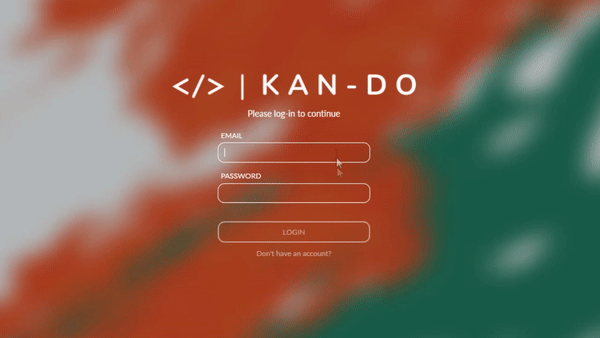
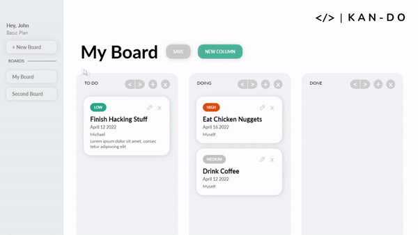
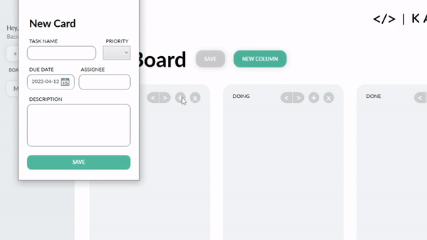

# **Kan-Do**
> The ability to do what others kan't

## About

This project is a way for individuals to organize their workspace and increase productivity. Taiichi Ōno, an industrial engineer at Toyota first developed an inventory control system used for just-in-time manufacturing. The name for this process directly translates to "Sign Board" and is also known, as Kanban. This idea sparked inspiration amongst the software community as many leaned into the idea of a just-in-time development cycle. Thus, the agile methodology of Kanban was born. 

## Table of Contents
* [Requirements](#requirements)
* [Releases](#releases)
* [Features](#features)
* [Future Updates](#future-updates)
* [Frequently Asked Questions](#frequently-asked-questions)
* [Authors](#authors)
* [License](#license)

## Requirements
* Windows 7+ _\(That's it!\)_

## Releases
The latest build can always be found in the [Releases] section. Currently, this application is only available on Windows OS with no plans to support other platforms.

## Features
> **Accounts**
> 

> **Custom Boards**
> 

> **Dynamic Cards**
> 

## Future Updates
Future feature updates include:
* Saving and loading boards
* Sorting cards
* Pomodoro Timer
* Online account syncing
* Board collaboration and sharing

## Frequently Asked Questions
### What happens if I forget my password?
Make a new account for now. We will add email password reset in a future update.
### Can I help with Kan-Do?
Absolutely! If you have an addition you would like us to look at, feel free to create a pull request.
### How much does this service cost?
Nothing. At this point in time Kan-Do is completely free of charge to use.
### What's your favourite colour?
A mixture between teal and turquoise.

## Authors
* **Serena Alli** - [serenalli](https://github.com/serenalli)
* **Harkiran Grewal** - [harkirangrewal](https://github.com/harkirangrewal)
* **Michael Karimizadeh** - [michaelkari](https://github.com/michaelkari)
* **Pierce Ramnarain** - [pierce-exe](https://github.com/pierce-exe)
* **Nasir Rehman** - [nsrehman](https://github.com/nsrehman)

## License
This project is licensed under the MIT License - see the [LICENSE](LICENSE) file for details

[Releases]: https://github.com/Kan-Do-Team/Kan-Do/releases
